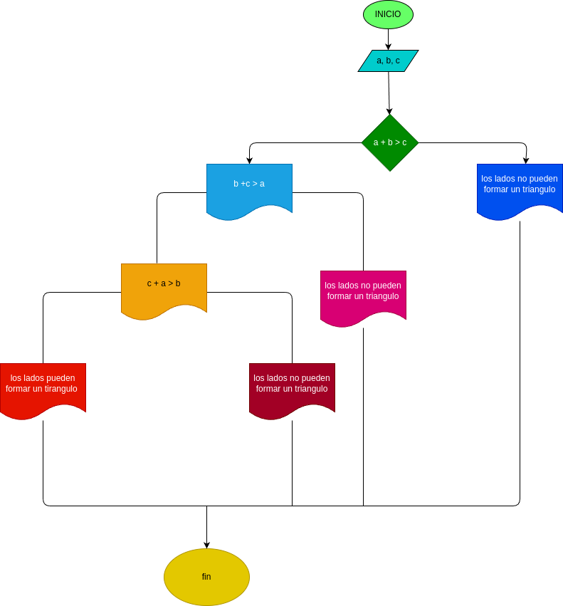

# quizz_instcciones_condicionales

# Anlisis

Este proyecto verifica si tres números pueden formar un triángulo o no.  

## Input  
El usuario debe ingresar tres números que representen los lados de un triángulo.

# Verificación de triángulo  

para verificar si tres números pueden formar un triángulo.  

# Proseccing
 
Para que tres lados formen un triángulo, deben cumplir la **desigualdad triangular**:  
- La suma de dos lados debe ser siempre mayor que el tercer lado.  
- Si alguna de estas condiciones no se cumple, los números no pueden formar un triángulo.  

## Salida (Output)  
El programa indicará si los números ingresados pueden formar un triángulo o no.  

## Diseño

